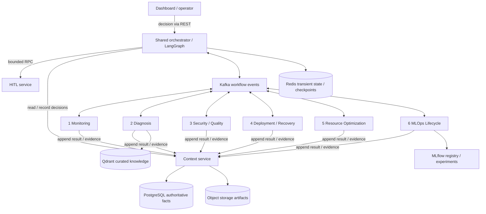

# Architecture

The platform observes services and models, opens incidents, gathers specialist evidence, selects
an action, checks policy, obtains approval when required, dispatches execution and verifies recovery.
This repository establishes the interfaces and development structure for that loop.

## Dependency direction

Contracts depend on Pydantic and the standard library. Agent implementations depend on contracts
and shared ports. Infrastructure adapters depend on those ports. Agents do not import each other.
The API uses an application factory and configuration injection to support independent tests.

`ContextAppender` is the interface allowed in agent dependency injection. `ContextReader` is for
the orchestrator only. This type-level boundary still needs workload authentication and server-side
authorization; a Python protocol is not an access-control mechanism.

## What works now

| Area | Current behavior | Remaining work |
| --- | --- | --- |
| Contracts | Strict event/task/action validation, JSON Schema export, synthetic examples | Compatibility policy and registry integration |
| Agents 1-5 | Validates task identity/deadline; returns NOT_IMPLEMENTED | Specialist algorithms and tools |
| Agent 6 | Local health assessment and synthetic training; registered binary/regression/text evaluations; custom evaluator plugins; optional structured-output OpenAI/Groq judge | Trusted production data and champion adapters, durable registration/evidence, calibration and orchestrated promotion |
| HTTP API | Liveness, skeleton readiness, six-agent inventory, local model-health assessment, OpenAPI | Identity, incidents, approvals and UI streams |
| Orchestrator | Initial analysis route plan and state model | LangGraph runtime, checkpoints and complete workflow |
| Policy | Deny-all assessment bound to action fingerprint | Approved risk matrix and evidence/freshness gates |
| Context/HITL/Kafka | Ports, schemas and explicit unavailable adapters | Durable storage, gRPC handlers and Kafka workers |
| Infrastructure | Compose definitions, K8s base and Terraform boundary | Image builds/runtime validation, provider configuration, production controls |
| ML/dashboard | Agent 6 local training/evaluation demo, other implementation slots and UI outline | Production pipelines and operator application |

## Communication

Events use `correlation_id` as the incident partition key, independent `priority` and `severity`,
immutable evidence IDs, causation, trace identity, bounded confidence and an idempotency key.
Kafka is at-least-once; production action handlers need durable idempotent effects. Ordering is
per partition. No consumer, outbox, retry worker or DLQ replay tool is active in this skeleton.

Context, HITL and Monitoring protobuf services use bounded synchronous RPCs. Deadline propagation,
retry-safe status mapping and mTLS/workload identity must be implemented with their servers.

## Action and approval boundary

An `ActionIntent` contains action identity/version, incident, environment, target, parameters,
preconditions and verification profile. Its canonical SHA-256 fingerprint binds an approval to the
whole intent. Nested dictionaries are mutable Python values: always revalidate and recompute the
fingerprint at trust boundaries. Freezing a Pydantic model does not make nested values immutable.

An action request is data, not authorization. Execution must independently verify policy,
authenticated actor/service identity, exact scope, approval token signature/binding/expiry,
context version and durable idempotency. No action backend is connected today.

## Independent deployment

The monorepo builds one package and one reusable image initially. Compose can start six processes
with distinct service names. These expose local health/inventory and model-health analysis
endpoints. Implement dedicated Kafka worker lifecycles and gRPC server entry points before calling them agent services. Per-agent
images and dependencies can be separated when runtime cost or release cadence justifies it.
