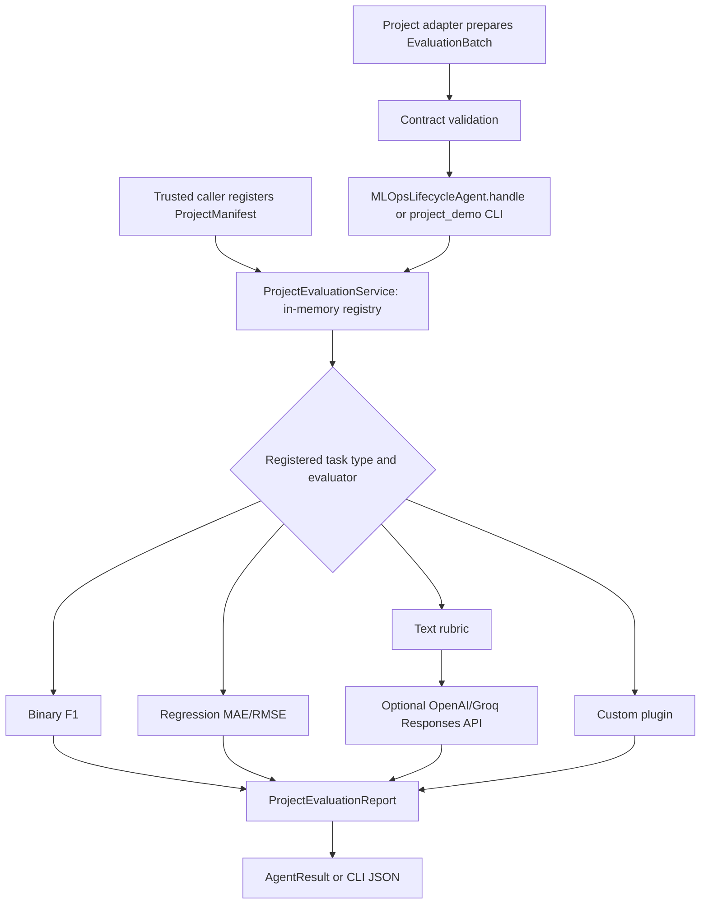
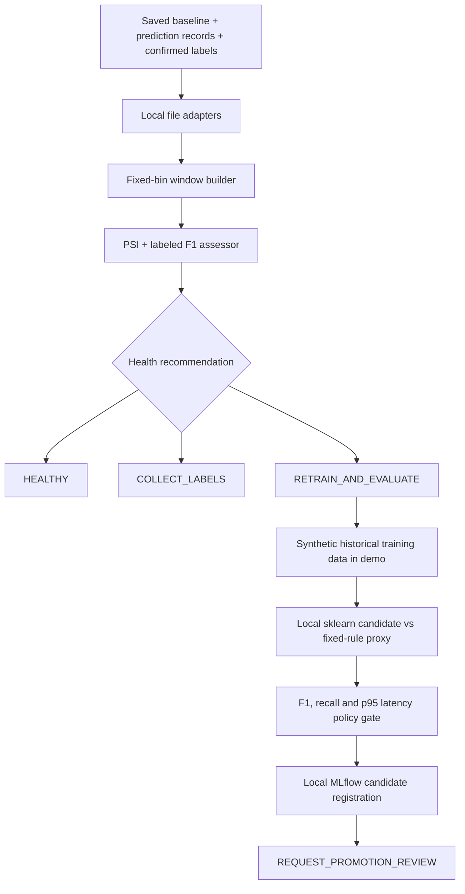

# Agent 6 architecture: current implementation

Agent 6 is `MLOpsLifecycleAgent` in [service.py](../service.py). Its status is
`PARTIAL`. It has a general project-evaluation path, a binary model-health path,
and one synthetic candidate-training demonstration. The paths share the agent
boundary but have different inputs and capabilities.

## Package ownership

| Package | Responsibility | Main files |
| --- | --- | --- |
| Root | Agent task boundary, lifecycle decision, stable command wrappers | [service.py](../service.py), [__main__.py](../__main__.py), [demo.py](../demo.py), [project_demo.py](../project_demo.py) |
| `evaluation/` | Registered project/evaluator lookup, policy gates, optional text judge | [engine.py](../evaluation/engine.py), [llm_judge.py](../evaluation/llm_judge.py) |
| `health/` | Fixed-bin windows, PSI, binary F1, health recommendation | [window_builder.py](../health/window_builder.py), [metrics.py](../health/metrics.py), [assessor.py](../health/assessor.py) |
| `training/` | Local candidate training and synthetic history | [pipeline.py](../training/pipeline.py), [demo_data.py](../training/demo_data.py) |
| `adapters/` | Development-only file readers and local MLflow registry | [local_files.py](../adapters/local_files.py), [mlflow_registry.py](../adapters/mlflow_registry.py) |
| `interfaces/` | Data-source, training and registry protocols | [ports.py](../interfaces/ports.py) |
| `cli/` | Implementations of the three local commands | [health.py](../cli/health.py), [lifecycle_demo.py](../cli/lifecycle_demo.py), [project_demo.py](../cli/project_demo.py) |

The shared contracts live in `src/contracts/` because the orchestrator and other
agents also use task and event schemas. The three top-level command modules are
small wrappers that preserve their established `python -m` commands.

## Project-neutral evaluation: implemented path

[ProjectManifest](../../../contracts/mlops_projects.py) fixes the project ID,
model ID/version, task type, evaluator ID and policy version. The service refuses
to silently change a registered model version's manifest in one process.
[EvaluationBatch](../../../contracts/mlops_projects.py) contains unique observation
IDs, task-specific samples, a dataset reference and an evidence reference.
The generic CLI reads both JSON files and registers the manifest for that run.
It calls `ProjectEvaluationService` directly. The agent's `handle` method is
a separate entry point for a pre-registered service receiving an `AgentTask`.

The service rejects unknown model versions and mismatched task types, checks the
minimum sample count, selects the registered evaluator, then verifies the returned
report still identifies the same model, policy, dataset, evidence and sample count.
Built-in evaluators are `binary-f1-v1`, `regression-mae-v1` and
`text-rubric-llm-v1`. A `custom` task requires a trusted Python plugin; JSON
alone does not install or execute a new plugin.

An `AgentResult.status` of `SUCCEEDED` means the evaluation task ran.
The report's `decision` is separate: `PASS`, `FAIL`,
`INSUFFICIENT_EVIDENCE` or `REVIEW_REQUIRED`. A `PASS` is a metric
result, and every project report requires human review before model promotion.
Text scores always return `REVIEW_REQUIRED`. The generic evaluation path
currently evaluates prepared predictions and answers; it does not open arbitrary
project models, read databases, or train candidates.

## Binary health and local lifecycle: implemented path

The local file adapters hash source bytes and return a saved baseline, a selected
prediction window and labels confirmed by an `as_of` cutoff. The window builder
joins records by observation ID and reuses the baseline's fixed numeric or
categorical bins. The health assessor computes PSI for each distribution and
labeled F1 against the baseline. Drift alone does not request retraining:
insufficient labels produce `COLLECT_LABELS`; sufficient labels with a large
F1 drop produce `RETRAIN_AND_EVALUATE`.

The separate local lifecycle demo supplies synthetic historical training rows,
compares a candidate with a fixed-rule champion proxy on a held-out split and
registers a candidate in local MLflow only if configured gates pass. Its final
`REQUEST_PROMOTION_REVIEW` is a request; it never deploys a model. The
external fraud-project script is an offline health integration check, not live
production monitoring.

## Boundaries that are still open

| Boundary | What exists now | Production requirement |
| --- | --- | --- |
| Data acquisition | Local JSON readers; prepared generic batches | Authenticated project connectors and durable prediction/outcome storage |
| Project registration | In-memory manifest lookup | Durable catalog with ownership, versioning and authorization |
| Evidence | Self-declared generic reference; local files use SHA-256 of source bytes | Stored immutable evidence with verified digests and retention |
| API | Prepared binary health endpoint only | Authenticated generic evaluation submission or evidence-reference workflow |
| Orchestration | Agent `handle` accepts bounded tasks | Durable routing, checkpointing, retries and audited decisions |
| Training | One synthetic binary sklearn example | Task-specific training plugins and actual deployed-champion comparison |
| LLM | Optional structured-output OpenAI/Groq adapter, mocked in tests | Approved data flow, budget/rate controls and calibrated human evaluation |
| Promotion | Candidate can request review | HITL approval, Agent 4 deployment, canary verification and rollback |

For the exact onboarding procedure, see [Project integration](integration.md).
For prioritized implementation work and completion criteria, see
[Next steps](next-steps.md).
