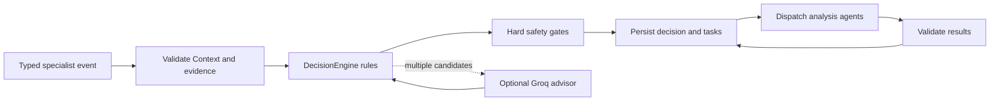

# Orchestrator core

This shared component reads typed events from specialist agents, validates their scope and
evidence, decides the next *analysis* destination, and checkpoints progress. It is not a
seventh agent. The implementation is a local/test supervisor; Kafka, Context Service
transport, LangGraph, policy, HITL and action execution remain integration work.

## Decision flow



The deterministic rules inspect typed fields, not the agent's free-form rationale:

| Incoming event | Decision |
| --- | --- |
| `monitoring.anomaly.detected` | Diagnosis; add MLOps Lifecycle when model ID and version are present |
| `diagnosis.completed` | Security/Quality for action candidates; add Resource Optimization for replica scaling or MLOps Lifecycle for model promotion |
| `resource.recommendation.created` | Security/Quality for a high-confidence replica change; otherwise review |
| `mlops.model.health.assessed` | Request retraining/evaluation, wait for labels, or take no action according to the typed decision |
| `quality.release.assessed` | Block on `BLOCK`; otherwise request review because v1 quality results do not bind an exact action fingerprint |

Missing evidence, weak diagnosis, unexpected resource actions, conflicting action IDs,
and quality blocks never advance to execution. A release marked `ALLOW` is still not an
authorization for any specific deployment. No decision path dispatches Agent 4.

Each `DecisionPlan` records the event, machine-readable reason, allowed next agents,
candidate action IDs and SHA-256 fingerprints. The checkpoint keeps only bounded task
context and decision summaries, not raw telemetry, prompts or action parameters.
The actual recommendation event must be retained by the authoritative Context Service
when that integration is built.

## Optional Groq advisor

Groq is **off by default**. It is called only when a diagnosis provides at least two
candidate actions (up to sixteen) that pass the hard routing gates and a safe
diagnosis code. Noncanonical action IDs also skip the advisor.
Versioned Jinja templates under decision/prompts/templates render a system instruction
and JSON context containing up to five validated hypothesis codes/probabilities,
candidate action IDs/types/fingerprints, environment and evidence count. It does not
receive raw evidence, action parameters or free-form rationale. Its strict JSON
response may name one *existing* candidate as a
preference for review; it cannot change required agent destinations, approve an action,
or remove a block. Invalid, timed-out or unavailable responses leave the deterministic
decision intact.

Install the optional advisor dependencies with `pip install -e ".[advisor]"`, then copy
`.env.example` to `.env` inside this orchestrator folder and set:

```dotenv
ORCHESTRATOR_GROQ_ENABLED=true
ORCHESTRATOR_GROQ_MODEL=openai/gpt-oss-20b
ORCHESTRATOR_GROQ_API_KEY=your_key_here
```

The private `.env` is ignored by Git and excluded from package and Docker artifacts.
Process environment variables take precedence. The model is configurable because Groq's
supported strict-output models can change; see [Groq Structured Outputs](https://console.groq.com/docs/structured-outputs).
To opt in from a trusted application entry point:

```python
from src.platform.orchestrator.decision.advisors.groq import configured_groq_advisor
from src.platform.orchestrator.decision.engine import DecisionEngine
from src.platform.orchestrator.service import Orchestrator

engine = DecisionEngine(advisor=configured_groq_advisor())
supervisor = Orchestrator(repository, context_reader, agents, decision_engine=engine)
```

The local demo and tests never call the live Groq API. The HTTP adapter is tested with
a mock transport.

## Durable task lifecycle

The plan is written before dispatch. A task is claimed with an atomic checkpoint
revision before calling an agent. Results must match the planned task, incident and
agent; cited evidence IDs must exist in the authoritative incident snapshot. A task
moves from `PENDING` to `DISPATCHING` and then a terminal status. Failure,
timeout, missing agent or `NOT_IMPLEMENTED` blocks progression.

A duplicate event with the same message ID, idempotency key and payload returns the
existing checkpoint. Conflicting reuse is rejected. After a crash, a
`DISPATCHING` task remains claimed; the system never blindly replays a call whose
effect is unknown. Production workers need an authenticated reconciliation path,
transport acknowledgments and durable inbox/outbox before retries can be enabled.

## Files and local example

| File | Role |
| --- | --- |
| `decision/contracts.py` | Typed, auditable decision and advisor records |
| `decision/engine.py` | Recommendation rules and guarded optional advice |
| `decision/advisors/groq.py` | Opt-in Groq strict-JSON adapter |
| `decision/prompts/renderer.py` | Renders bounded context with strict Jinja variables |
| `decision/prompts/templates/*.j2` | Versioned system and user prompts |
| `service.py` | Intake, trusted-context checks, task planning and result transitions |
| `state.py` | Checkpoint and stage contracts |
| `repository.py` | Local SQLite compare-and-swap checkpoint adapter |
| `router.py` | Legacy simple route helper for scaffold compatibility |
| `graph.py` | Reserved LangGraph integration boundary |

Run the recommendation example from the repository root:

```powershell
.\.venv\Scripts\python.exe -m scripts.demo_orchestrator
```

The example runs an anomaly, then a diagnosis recommending rollback, and shows
the resulting Security/Quality destination. It uses synthetic evidence and a
temporary SQLite file.

## Integration boundary

This branch has no Kafka consumer, authenticated event source, live Context Service
adapter, exact-action policy assessment, HITL decision path, action publisher,
independent recovery verification or production database. SQLite is a local durable
adapter, not distributed production storage. The next integration phase must bind
quality decisions to exact action fingerprints, enforce authenticated workload
identity and policy, add durable transport/idempotency, and test approval,
execution and verification end to end.
